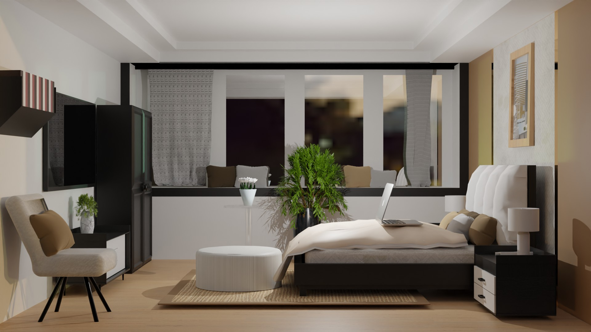

# Ikea-projet-room-tour

## "Ikea - The room tour" - kézako ? 

Il s'agit d'un projet de modélisation 3D et de création d'une page sous React, React-three-fiber et React-three-drei, qui permet de visualiser l'objet dans la scène, et cela, en complément des photos d'ambiance qui mettent en avant le produit. En s'insiprant des espaces de vente physique d'Ikea, la "Room Tour" reprend le code de scène d'ambiance proposer une expérience utilisateur qui soit à la fois immersive et exploratrice. Une nouvelle façon de concevoir l'expérience d'achat, en reprenant les règles du merchandising mais adapté pour le web, permettant :

- Découvrir le produit en 3D, pour avoir un aperçu du produit dans son environnement,
- S'immerger dans la scène afin de se projeter dans sa future chambre et ainsi, récolter de l'inspiration décoration ou encore, découvrir d'autres produits complémentaire avec l'objet qu'on souhaite acheter.

Pour découvrir la scène, rien de plus simple : utiliser sa souris ou son pad pour tourner, zoomer ou se déplacer autour de la scène. 

Des fonctionnalités seront peut-être rajouté sur cette page mais en attendant, voici la version 1 ☺️

Enjoy !

